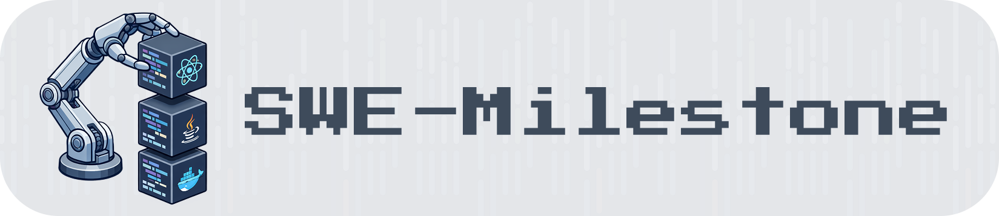
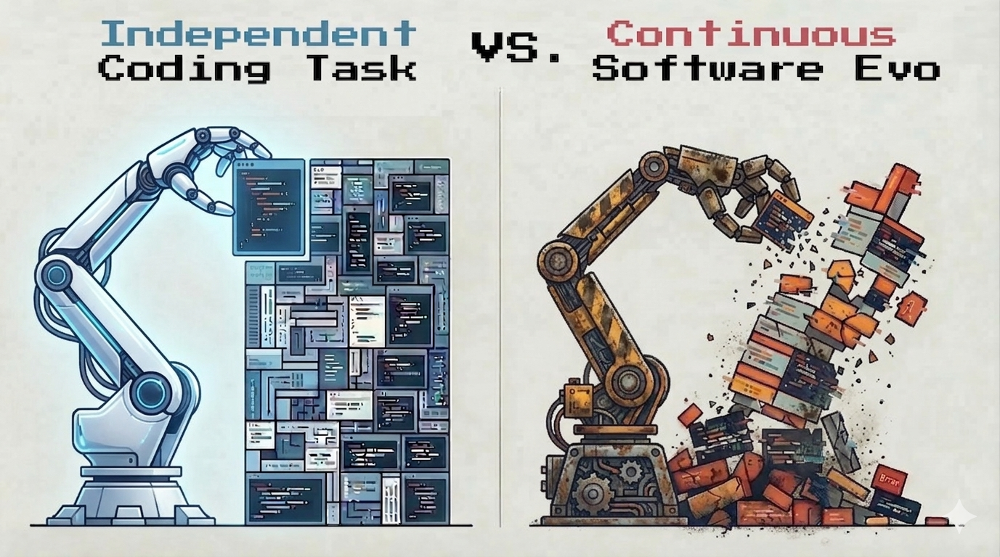
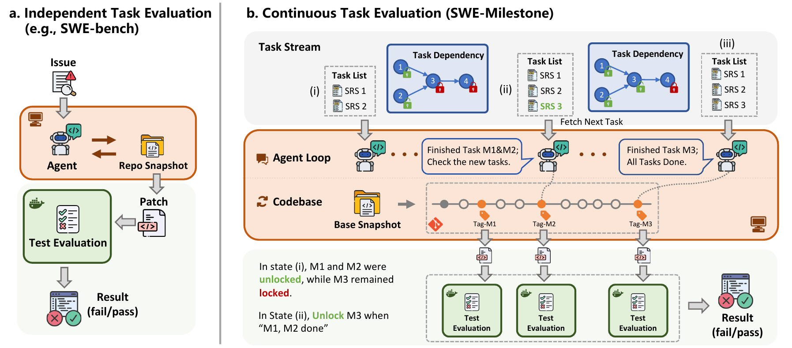
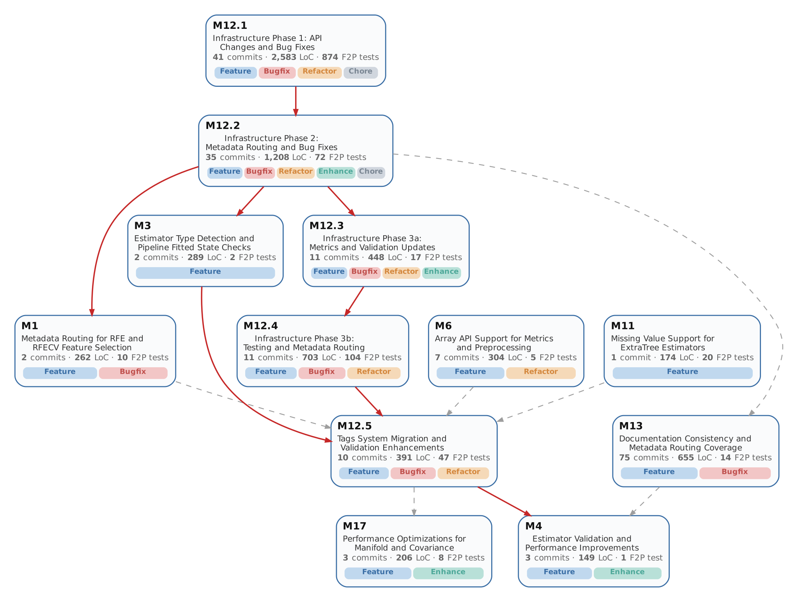

<p align="center">
  
</p>

<p align="center">
  <b>Evaluating AI agents on continuous software evolution, structured as a milestone DAG, across real release histories.</b>
</p>

<p align="center">
  <a href="https://swe-milestone.com/"></a>
  <a href="https://arxiv.org/abs/2603.13428"></a>
  <a href="https://huggingface.co/datasets/DeepCommit-ai/SWE-Milestone-data"></a>
  <a href="https://github.com/DeepCommit-ai/DeepCommit"></a>
  <a href="https://hub.docker.com/u/hyd2apse"></a>
  <a href="https://opensource.org/licenses/MIT"></a>
  <a href="https://www.python.org/downloads/"></a>
</p>

---

Most existing benchmarks evaluate agents on **isolated, one-shot tasks**. But real-world workflows are not a bag of independent missions, they are continuous processes where tasks build on each other, dependencies interleave, and context accumulates over a long session.

<p align="center">
  
</p>

**SWE-Milestone** is a general-purpose evaluation harness for **continuous tasks**. It drops an AI agent into a working environment and challenges it to complete an ordered sequence of milestones. As the agent works, SWE-Milestone silently extracts checkpoints, evaluates each milestone, and asynchronously unlocks downstream tasks, enabling fine-grained, per-milestone analysis without interrupting the agent's session. 

<p align="center">
  
</p>

<p align="center">
  
</p>
<p align="center"><i>A real milestone DAG: the scikit-learn 1.5.2 → 1.6.0 itinerary — nodes are milestones, edges are dependencies that gate when downstream tasks unlock.</i></p>

Currently focused on **software evolution**, SWE-Milestone's architecture is designed to extend to other domains.

## ✨ Key Features

- **Test Your Model**: Out of the box, SWE-Milestone ships with the [SWE-Milestone Benchmark](https://arxiv.org/abs/2603.13428) (long-horizon software evolution itineraries from 7 real-world repos) and 4 pre-configured agent frameworks ([Claude Code](https://docs.anthropic.com/en/docs/claude-code), [Codex](https://openai.com/index/codex/), [Gemini CLI](https://github.com/google-gemini/gemini-cli), [OpenHands](https://github.com/All-Hands-AI/OpenHands)). Provide a model API key and start evaluating.

- **Bring Your Own Agent**: The agent layer is decoupled from the evaluation engine (see below). Plug in your own agent by implementing a lightweight adapter. SWE-Milestone also provides a per-milestone analysis framework for detailed performance breakdowns.

- **Bring Your Own Data**: Supply your own task descriptions, test environments (Docker), test list for scoring, and task dependencies. SWE-Milestone handles orchestration, checkpoint-based evaluation, and reporting, enabling continuous task evaluation beyond coding.

## 👋 Overview

<p align="center">
  
</p>

Each evaluation trial works as follows:

1. An agent is dropped into a persistent Docker container with a workspace at a given starting state.
2. It receives a sequence of **task specifications** describing tasks to achieve.
3. Tasks are ordered by a **dependency DAG**---downstream tasks unlock as upstream ones are completed.
4. The agent signals completion by creating git tags (e.g., `agent-impl-milestone_001`).
5. A **watcher thread** silently detects tags, extracts artifact snapshots, and runs pre-defined automated validation in a separate, one-time task evaluation container.
6. Results, logs, and outcomes are automatically collected and analyzed per task.

## 🔧 Setup

**0. Prerequisites**

- Python >= 3.10
- Docker
- Model API access via environment variables: `UNIFIED_API_KEY` and `UNIFIED_BASE_URL`

**1. Installation**

```bash
git clone https://github.com/DeepCommit-ai/SWE-Milestone.git
cd SWE-Milestone
uv sync
```

**2. Data & Docker Images**

Workspace data is hosted on [HuggingFace](https://huggingface.co/datasets/DeepCommit-ai/SWE-Milestone-data). Docker images are hosted on [DockerHub](https://hub.docker.com/u/hyd2apse).

```bash
# Download workspace data
git lfs install
git clone https://huggingface.co/datasets/DeepCommit-ai/SWE-Milestone-data

# Point the harness at it — set once in .env_private (gitignored, auto-loaded on every launch)
cp .env .env_private
# edit .env_private →  SWE_MILESTONE_DATA_ROOT=$PWD/SWE-Milestone-data

# Align the data checkout to the pinned benchmark version (manifests/BENCHMARK_VERSION)
./scripts/pull_data.sh

# Pull all images by content digest (login first — anonymous pulls are rate-limited, ~115 images)
docker login
./scripts/pull_images.sh
```

> See [docs/setup.md](docs/setup.md) for the full data layout and image naming scheme, and [docs/versioning.md](docs/versioning.md) for the versioning policy.

Trial configs then use `data_root: ${SWE_MILESTONE_DATA_ROOT}` — no host path to repeat, and the same variable drives `pull_data.sh` and the launch-time version gate. (Anti-cheat *quarantine* is auto-on per repo and needs no extra host paths; see [docs/quarantine.md](docs/quarantine.md).)

## 🚀 Usage

> Hand [`docs/running-trials.md`](docs/running-trials.md) to your agent — it has everything needed to launch trials, monitor progress, recover stuck repos autonomously, and manage trial IDs.

**1. Configure** — copy the template and edit:

```bash
cp trial_config.example.yaml trial_config.yaml
```

```yaml
# modify trial_config.yaml 
data_root: ${SWE_MILESTONE_DATA_ROOT}        # set once in .env_private (or hardcode a path)
trial_name: my_experiment              # name for this evaluation run
agent: claude-code                     # agent: claude-code | codex | gemini-cli | openhands
model: claude-opus-4-7                 # model identifier (use claude-opus-4-7[1m] for 1M context)
timeout: 18000                         # optional: max agent runtime per repo (seconds)
# reasoning_effort: high               # optional: low | medium | high | xhigh | max 
# repos: [navidrome, ripgrep]          # optional: run only these repos (default: all)
# agent_version: 2.1.210               # optional: pin the agent CLI version (claude-code | codex | gemini-cli)
```

> **Naming convention:** a trial name without a suffix runs the **200K** context regime in Claude Code (pinned via `auto_compact_window: 200000`); only a `-1m` suffix means 1M context (e.g. `claude-code_opus-4.7-1m`, model `claude-opus-4-7[1m]`).

> **New model or Vertex AI?** See [docs/adding-a-model.md](docs/adding-a-model.md); for Vertex (ADC auth, no API key) set `vertex_ai: true` — see [docs/vertex-ai.md](docs/vertex-ai.md).

**2. Run** — evaluate across all repos:

```bash
export UNIFIED_API_KEY=sk-...
export UNIFIED_BASE_URL=https://...   # optional, for proxy or custom endpoints
# NOTE: if UNIFIED_BASE_URL is a custom domain, add it to WHITELISTED_DOMAINS
# in harness/e2e/container_setup.py — agent containers block all other outbound traffic.
python scripts/run_all.py --config trial_config.yaml
```

> **See [docs/running-trials.md](docs/running-trials.md) for the day-to-day operational runbook (launch, monitor, recover from stuck repos)**, and [docs/advanced.md](docs/advanced.md) for single-repo / single-milestone debugging, result collection, `e2e_config.yaml`, and lock internals.

**3. Monitor** — check progress in another terminal:

```bash
./scripts/monitor.sh                              # auto-detects trial, compact view
./scripts/monitor.sh my_experiment --detail        # per-milestone breakdown
./scripts/monitor.sh my_experiment --full          # full table with all columns
```

## 🔍 Troubleshooting

<details>
<summary><b>Network access blocked inside containers</b></summary>

Agent containers enforce an iptables outbound whitelist — only API and package-manager domains are allowed (e.g. `api.anthropic.com`, `registry.npmjs.org`, `pypi.org`); code-hosting sites (GitHub, GitLab, …) are blocked to prevent data leakage. Routing through a custom proxy? Add its domain to `WHITELISTED_DOMAINS` in `harness/e2e/container_setup.py`.

Plain-HTTP (port 80) blocked by your host? No action needed — the harness rewrites apt sources to HTTPS automatically.

</details>

<details>
<summary><b>Agent stopped before all milestones completed — how to resume</b></summary>

Re-run the same command; it resumes from where the worker left off:

```bash
python scripts/run_all.py --config trial_config.yaml
```

**Evaluation protocol:** reported SWE-Milestone results resume trials until every milestone is submitted and evaluated. Each resume reuses the agent session (preserving the model's memory of prior work); after three consecutive resumes with no new submissions, a fresh session is rotated in automatically. Reproducibility studies should follow the same setting.

⚠️ Not every "no progress" is the agent's fault: rate-limit (429), quota, or auth (401/403) errors also stop workers, and session rotation won't fix them. Check the session jsonl for `api_error_status: 429` / `"reached your usage limit"` / `401` and fix the key **before** resuming.

**Never delete a running trial's container** — all in-progress work (code, git history, conversation memory) lives inside it; once it's gone only `--force` (restart from scratch) remains. Snapshots of already-evaluated milestones survive on the host under `evaluation/`.

</details>

<details>
<summary><b>Image or data version mismatch</b></summary>

Containers start with `--pull=never`: a missing local image fails loudly instead of silently fetching. Align your machine with the release (digest-exact, near-free thanks to layer dedup):

```bash
./scripts/pull_images.sh                          # pulls by content digest from manifests/digests-v1.0.tsv
python3 scripts/verify_image_digests.py --local   # confirm local bytes match the frozen manifest
```

The launcher also checks that the data repo is on the matching version tag (default `v1.0`, from `SWE_MILESTONE_IMAGE_TAG`); if it refuses with a version mismatch, update the data checkout: `git -C $SWE_MILESTONE_DATA_ROOT fetch --tags && git -C $SWE_MILESTONE_DATA_ROOT checkout v1.0`.

</details>

## 🤝 Contributing

We welcome contributions! Whether it's adding support for new agents, new task domains, new datasets, bug fixes, or documentation improvements.

## ✍️ Citation

Welcome to cite our paper if you find SWE-Milestone useful!

```bibtex
@misc{deng2026swemilestoneevaluatingaiagents,
      title={SWE-Milestone: Evaluating AI Agents on Continuous Software Evolution},
      author={Gangda Deng and Zhaoling Chen and Zhongming Yu and Haoyang Fan and Yuhong Liu and Yuxin Yang and Dhruv Parikh and Rajgopal Kannan and Le Cong and Mengdi Wang and Qian Zhang and Viktor Prasanna and Xiangru Tang and Xingyao Wang},
      year={2026},
      eprint={2603.13428},
      archivePrefix={arXiv},
      primaryClass={cs.SE},
      url={https://arxiv.org/abs/2603.13428},
}
```

## 📄 License

This project is licensed under the [MIT](LICENSE) License.
